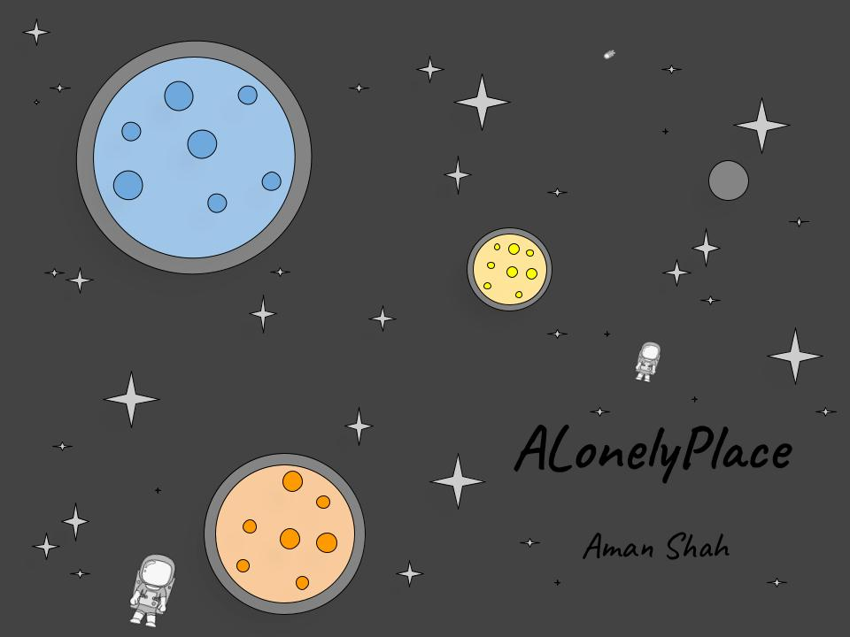

# Cover
  
# Author’s Introduction  
Dear Reader,  
  
This compilation of poems was inspired by the theme “A Lonely Place”. Here, I took common places where people usually can’t explore and expand on why such places are lonely. I used space, the ocean, desert, jungle, and city. These _5_ places are considered to take up most of Earth geographically. I use language to express why people, the planet, and objects feel the sense of loneliness despite being vast or near someone. This compilation of poems took multiple hours to complete. Including the graphics for the cover, the _POEMS_ themself, and creating the website.  
  
My favorite poem is "Space, A Time & Place". Thank you for taking your time to view the Collection. Enjoy!  
  
Aman Shah  
_P.S. Mr. Dalley, I hope I get full credit!_ 😃  

# POEMS - Start
## Space, A Time & Place
Couldn’t stop thinking about Space  
It is so empty and far  
he could never forget the Place  
  
So distant and cold, it grew tenfold  
Breaking most of the case  
Couldn’t stop thinking about Space  
  
Ever so expanding, without a trace  
With only god’s grace  
he could never forget the Place  
  
Take the rocket for a spin, and use the interface  
You might need to use the hyperspace  
Couldn’t stop thinking about Space  
  
Just in case,  
Break the barrier to win the race  
he could never forget the Place  
  
So distant and cold, it can replace
A place of hope, A place to scope
Couldn’t stop thinking about Space
he could never forget the Place

## So …
Look around it’s free  
Animals can roam the Earth pleased  
So, don’t put a fee  

## Ocean, Roaring Waves  
The sea is vast and furious  
Crushes the ships under its thumb  
She is gentle but rude, to invaders  
  
She cares for the creatures within  
Poisoned by those who don’t care  
The sea is vast and furious  
  
She provides, being taken advantage of  
Crying, Sad, Depressed, she is Alone  
She is gentle but rude, to invaders  
  
Why she asks, for help she doesn’t get  
Why she asks, as crude gets dumped  
The sea is vast and furious  
  
No one cares for her friends  
Her hands are tied  
She is gentle but rude, to invaders  
  
She weeps, she pleads, no one listens  
Alone, in such a large world she roars  
The sea is vast and furious  
She is gentle but rude, to invaders  
  
## Life Once Again
Life moves on despite,  
You giving permission to it  
Enjoy, what you have, ok?  

## Desert, Not Dessert
Bone-Dry, with only a lizard passing by  
A villager separated from the pack, lost  
Only time can tell if anyone can survive  
  
Not a drop-in site, can’t get ready for that fight  
Separated from the pack, not a civilian in site, can’t get ready for that fight  
Bone-Dry, with only a lizard passing by  
  
Help isn’t on its way  
Lost from civilization, all alone  
Only time can tell if anyone can survive  
  
Hoping for a plater, only cactus for him  
No dessert his way, no water in site  
Bone-Dry, with only a lizard passing by  
  
Fights to survive, can’t see his pack    
No Dessert, No Food, No Water  
Only time can tell if anyone can survive  
  
Mind twisting, turning, out of control  
Only Desert for miles, nothing in site  
Bone-Dry, with only a lizard passing by  
Only time can tell if anyone can survive  

## Spoiled Milk
Don’t cry over spilled milk  
It was going to be bad anyway  
Smile, it is now cheese  

## Jungle, Here’s my Fury
Green vines all around, the jaguar crys  
The lone wolf of the jungle  
He roars, eyes blazing, power unspoken  
  
He lurks in the shadow, pouncing at the right time  
No friends, he is the hero in his own story  
Green vines all around, the jaguar crys  
  
Pain in his eyes, not trusted by his friend  
The Brutus of all the animals, a traitor to all  
He roars, eyes blazing, power unspoken  
  
Agile, Nimble, and ready at all times  
Sometimes thought to be a backstabber, just an offender, he’s a cat  
Green vines all around, the jaguar crys  
  
Why? He pleads, he prays. The Lone Wolf of the Jungle.  
He hunts by himself, he eats by himself  
He roars, eyes blazing, power unspoken  
  
His fury masked, sad, wanting more  
No trust, just the flame of his’s fury  
Green vines all around, the jaguar crys  
He roars, eyes blazing, power unspoken  

## science
Life as we know it  
So young, so beautiful  
It shall grow forever  

## Urban, Dust & Debris
Cars, Buses, Trains, Planes zipping around  
Polluting mostly everything in their path  
Not a care about the planet as they move  
  
Many speak for God’s Wonder,  
Many adjourn, rejecting the pollution’s effect  
Cars, Buses, Trains, Planes zipping around  
  
Earth crumbles, wilts, dies away  
Providing life to these ungrateful peasants  
Not a care about the planet as they move  
  
Rummaging through Mother E.  
Sucking the life out of her  
Cars, Buses, Trains, Planes zipping around  
  
She will fade if nothing is done  
Factories pump, gush, slew more vehicles - it’s only just begun  
Not a care about the planet as they move  
  
Rushing for a late appointment, what a disappointment,  
Can’t be fixed with an ointment  
Cars, Buses, Trains, Planes zipping around  
Not a care about the planet as they move  
  
## The Flower Tree
The flower grew such  
it wanted to be a tree  
alone in a field  

# Description
Aman Shah is a Junior at WHS! He plays tennis on a regular basis. Currently, holding the position of JV Captain and starter. He continues to participate in _M.U.N._ and has done so for 3 years now, racking multiple awards. Lastly, he loves to speedrun video games in his spare time, playing MarioKart, but mostly _Legend of Zelda: Spirit Tracks_ wanting to get a Nintendo Switch Pro later this year if it releases. He is a HUGE Nintendo Fan Boy, despises Apple, and believes that Andriod is superior to IOS. Born in Bellflower, California he resides in Cerritos now for 16 years. In this collection, he demonstrates his love for poetry and the intricacies of living boldly despite lonely times.  

# Blurbs
“Simply Amazing, Can’t Believe What art, he has proven himself once again. BRAVO!”  
 - _Amber_  
  
“Wow! Absolutely wonderful it really gets you thinking!”  
 - _Nikhil_  
  
“A Delight! Just so many good pieces! Aman has outdone himself again.”  
 - _Priti_  
  
**_5 Vignettes (19 x 5) = 95 + 5 Haikus (3 x 5) = 110 LINES_**
  
