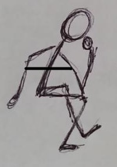

# Original Poetry
## Spoiled Milk (Haiku [5])
Don’t cry over spilled milk  
It was going bad anyway  
Smile, it is now cheese  

## not-employment (Free Verse [10])
Don’t believe,  
you are not important.  
Don’t think the dough will be waiting,  
you are not important.  

Like pliable plastic you can proudly say your profoundly poor,  
you are not indispensable  
you are not important.  
Swaying in the wind, you find the drug store.  
you find him on the corner, selling the stuff.  

Getting dumb as dirt,  
you are now an idiot in the eyes of the passerby.  
Wee-U- Wee-U!  
Finding yourself in a cell, with no hope, no life, no family, no soul.  

Thinking life will get better, broke and on the road  
you are not happy, life has left your eyes.  
you are not going to get that dollar slice.  
you are not going to get the spot anymore  
you are not going to get your soul  

Run to the nearest stop to get away  
You hold your heart in your hand as you fade.   
Don’t believe,  
you are no longer important.  

## Couldn't Stop Thinking of Space (Villanelle [10])
Johnson couldn’t stop thinking about space  
It was just so distant and far  
But he could never forget his place  

That night, Johnson encountered the stars of space  
He had to calm himself with physics  
Johnson couldn't stop thinking about space  

Later, Johnson was spooked by a mace  
He tried to focus on his favorite lyrics  
But he could never forget his place  

Aman tired to distract him with a brake  
Said it was time to start thinking about Civics  
Though Johnson couldn’t stop thinking about space  

Johnson took running like in a race  
Space was distant like a hieroglyphic  
But he could never forget his place  

Johnson might be put on the case  
His mind turned to statistics  
Johnson couldn't stop thinking about space  
But he could never forget his place  

## Crazy Milk (Sonnet [20])
You are so crazy and I must agree  
You need some chocolate milk right now for free  
I won’t be giving it away, you see  
In all its form, from whole to 2%  

Milk is a beverage that’s hard to beat.  
It’s packed with nutrients and calcium,  
so it’s good for the body as well as the soul.  
Whether you drink it straight from the carton  

or use it in your favorite recipes,  
milk is a versatile and nourishing drink  
It’s a delicious, refreshing treat  
that has something to offer everyone.  

So next time you’re feeling thirsty,  
reach for a glass of milk and be free.  

# Short Fiction Piece
## A Nite to Remember ([30])
It was a great day, like no other, it was a day to remember. The best day of my life you could say. I would not trade it, barter, or exchange it for anything. Either way, this has definitely changed my life for the better. It all started that day she moved in 2 years ago.

I had recently quit my low paying job at Uber to go work at Google for a higher salary. Turns out, they wanted me to work as an unpaid intern for a year before getting the senior adviser job with a promising six-figure salary. At the time, I thought it was worth it. I ended up having to rent out a bedroom in my apartment; which took a big hit on my mental health. One Sunday evening, 2 weeks after I put up my ad for a roommate, with no luck, my friends and I had been sitting on my sofa playing video games and stuck to a conservation. 

“Ivan, let me pay your rent. It’s no biggie!” exclaimed Syler. Syler Eaves is my friend who happens to be a Lawyer and happens to be rich due to his high profile clients. “You won’t be getting the ladies if you have a roommate, dude!” 

“I don’t need help Syler, I am sure someone will likely come along sooner or later” I responded, not wanting to be bailed out by a close friend. I am independent, this was my decision, and I have to be responsible for that. “Besides, the ladies don’t care if I have a roommate.” 

“What do you know about ladies Ivan?” asked Teddy, my other friend. Unlike me, he was also on payroll, he works as a Laboratory Assistant. Doing dangerous labs for a living. I know he is happy with what he's got. “I gotta gal, and man it feels great.” 

That was the last time I saw my friends before I got a tenant for my room. I went down to the local real estate agent’s office to get the paperwork, terms, and signatures sorted before the person could move in. It wasn’t a very hard process, but why does the line have to be so long to get anything done in this town? I went to the grocery store after the terms were drafted. I was running low on food; I saw this lady, she was helping an old man get his groceries to the car. I probably thought it was her grandfather, other than that it was a normal shopping day. I got home, waiting for my tenant to show up, so we can review the draft and payment options. She was running late, and I was about to rip the agreement. However, I heard a sharp knock on the door. It was her, the woman helping the old man. “Oh, you are here,” I remarked, wanting this to go well. 

“Yes, I was running late, this man needed some assistance with his food. I think you were there too if I am not mistaken?” How did she know? I had to put up a charade, but in the corner of my eye, I saw my grocery bags still on the dining table. There was no point in lying. 

“Yes, I was. I wanted to be here on time.” I retorted. 

“Of course, so … let's get those papers signed!” 

We happened to have dinner together a few nights later, and I found out that she is actually a resident at the local hospital. She has been working there for not so long now, and she needed a place to stay that was cheap. 

“So why my place?”

“It's the closest to the hospital, it has a great view of the beach” she points to the window, “and it was unexpectedly cheap considering other options on the market. I thought it must be a joke, I am glad it wasn’t” 

As the days moved on, I realized her beauty. Her great eyes, and the way she treats others. She exhibits joy and confidence like no one I have seen before. I wanted to ask her out, but I know she is going to say no. It will make things awkward since I am going to be living with her for at least another 6 months. She wasn’t around much, considering she had to work 70 hours a week. I had a bright idea to make dinner for both of us. If she likes it, then maybe I might ask her. If not, it was a nice gesture. Good thinking Ivan. 

“I made us a few pizzas if you want to join me. I know you probably ate already but I doubt I can eat these myself”

“Sure, that smells great. Let me go change out of my scrubs, I will be there. Don’t start without me!” Her eyes lit up as if I had brought her gold or silver to a king. We ended up eating dinner together that night. The next day she was off, and she made us dinner. It was quite unexpected. We took turns making dinner for quite a while. 

I hadn’t seen Syler or Teddy in a while, they asked how the new roommate was going. Turns out when they found out I had been living with a girl, they were more interested in renting out one of their rooms too. Wanting to get that sweet roommate love. 

A few days ago, I was walking down Ralphs and saw a bouquet of flowers. I purchased them and attempted to give them to Alexis. I asked, “Would you like to go out with me?” Turns out she did. The date went so well that she officially moved in after the contract was terminated. She eventually started sleeping in my bed. And that was a day to remember, for it was like no other, 6 months ago.

# About the Author: AMAN NIKHIL SHAH ([10])

Aman Shah is a Senior at Gretchen Whitney High School, graduating on June 8th 2022! 
He played Tennis on a regular basis at Don Knabe Regional Park and is on the official Whitney Tennis Team. He participated in Model United Nations and has done so for 4 years now, racking multiple awards ranging from Best Delegate to Accommodation. He loves to contribute to the community and will continue to go to M.U.N conferences at UC Berkeley. In his spare time, which has gotten significantly larger in the past few weeks, Aman enjoys speedrunning video games like: MarioKart and Legend of Zelda: Spirit Tracks. As a HUGE Nintendo Fan Boy, Aman was super excited to receive a Nintendo Switch OLED edition for graduation. Further, he takes delight in cooking for his family, and spending time with them. 

Aman is about to enter a new phase of his life, where he is super excited to leave Cerritos - a place he called home for his whole life, 18 plus years - to embark on a journey nearly 400 miles away. He believes that he will enjoy his time there and continue to pursue his dream of becoming an Immunologist. He will never forget the friends, family, and educators he has left behind. The times at Grad Nite and how they mischievously stole his food to make him spend more money. Or the times he enjoyed being on a Zoom call with his friends after online classes to grind for Math Anal. Aman is happy to take this leap with a few other Whitney students. Because he needs to leave early for the Summer session, he will only have a few weeks after graduation to really enjoy summer. He has made plans to go visit a few national parks and Las Vegas. As a first time going, Aman has high hopes for this well deserved vacation. 

